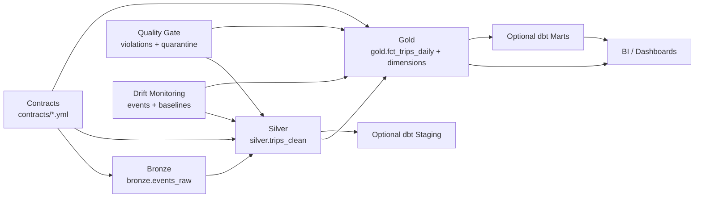

# NYC TLC Lakehouse

[](https://github.com/phaiffer/nyc-tlc-lakehouse/actions/workflows/ci-contracts.yml)

Local Spark + Delta Lakehouse project built as a production-style portfolio implementation. It ingests NYC TLC parquet data into a Medallion model (Bronze/Silver/Gold), enforces versioned data contracts, and persists quality outcomes (quarantine, rule violations, metrics, and drift events) using an embedded Hive metastore for deterministic local reruns.

## Architecture Overview

- Medallion flow:
  - `bronze.events_raw`: raw ingest with deterministic schema normalization/casts
  - `silver.trips_clean`: canonical trip model with contract enforcement and incremental merge
  - `gold.fct_trips_daily`: daily KPI fact with incremental merge
- Quality layer:
  - `quality.quarantine_records`: invalid rows rejected by contract rules
  - `quality.violations_summary`: quality gate rule outcomes with severity
  - `quality.pipeline_metrics`: stage-level run metrics
  - `quality.drift_events`, `quality.drift_baseline_metrics`: drift monitoring
- Reference dimensions:
  - `gold.dim_vendor`, `gold.dim_payment_type`, `gold.dim_rate_code`



## Quickstart

Supported local flow:

```bash
make setup
make download YEAR=2024 MONTH=1
make reset
make run YEAR=2024 MONTH=1
make inspect
make check
```

## Developer Workflow

```bash
make fmt
make lint
make test
make check
make doctor
make verify
make run YEAR=2024 MONTH=1
make inspect
make reset
```

Defaults: `YEAR=2024`, `MONTH=1`.

## Optional dbt Layer Workflow

The dbt layer is optional and not part of `make check` or CI gates.

Prerequisites:

- Run the Spark pipeline first so dbt sources exist:

```bash
make reset
make run YEAR=2024 MONTH=1
make inspect
```

- Install dbt plus a compatible adapter (example local adapter):

```bash
pip install dbt-core dbt-spark
```

Run optional dbt targets:

```bash
make dbt-parse
make dbt-run
make dbt-test
make dbt-docs
```

Default Make variables:

- `DBT_DIR=dbt/lakehouse_dbt`
- `DBT_PROFILES_DIR=dbt/lakehouse_dbt/profiles`
- `DBT_TARGET=local`

Overrides:

```bash
make dbt-parse DBT_TARGET=local
make dbt-run DBT_PROFILES_DIR=/absolute/path/to/profiles_dir
```

dbt models built by this project:

- `stg_silver_trips_clean` (staging view from `silver.trips_clean`)
- `mart_daily_revenue` and `mart_vendor_profile` (optional marts for BI/dashboard use)

## Outputs

- `bronze.events_raw`: normalized raw source with ingest metadata.
- `silver.trips_clean`: cleaned, deduplicated trip-level model.
- `gold.fct_trips_daily`: daily vendor-level KPI mart (`trips`, `total_fare`).
- `gold.dim_vendor`: vendor semantics.
- `gold.dim_payment_type`: payment type lookup.
- `gold.dim_rate_code`: rate code lookup.
- `quality.quarantine_records`: contract-invalid rows + reason metadata.
- `quality.violations_summary`: quality rule pass/fail counts and thresholds.
- `quality.pipeline_metrics`: structured Silver/Gold run metrics.
- `quality.drift_events`: emitted drift alerts by dataset/metric.
- `quality.drift_baseline_metrics`: baseline profiles used for drift comparison.

## Data Quality And Contracts

- Contracts live in `contracts/bronze`, `contracts/silver`, and `contracts/gold`.
- Contract `version` is mandatory; breaking changes require a version bump (enforced in CI).
- Silver/Gold contracts define `primary_key`, `watermark`, and `late_arrival_days`.
- Quarantine is append-oriented and stores rule metadata (`rule_id`, `severity`, `reason_code`, `run_id`, `run_ts`).
- Quality gate severity:
  - `error`: fails the run in strict mode.
  - `warn`/`info`: recorded for observability without strict failure.

## Idempotency And Incremental Merge

- Bronze applies deterministic type normalization before persistence to avoid rerun drift.
- Silver and Gold use deterministic dedup + Delta incremental merge keyed by contract PK.
- Merge windows use contract watermarks and a late-arrival lookback:
  - Silver: `updated_at`, 7 days
  - Gold: `trip_date`, 7 days
- Writes disable implicit schema evolution (`mergeSchema=false`) and use controlled table recreation only when schema conflicts are detected.

## Local Environment Notes

These warnings are expected in local embedded-metastore mode and do not indicate pipeline failure by themselves:

- Hive SerDe compatibility for Delta tables (`Couldn't find corresponding Hive SerDe ... delta`)
- native Hadoop library warning (`Unable to load native-hadoop library ...`)
- hostname loopback warning (`resolves to a loopback address ...`)

Inspect local catalog state with:

```bash
make inspect
```

The local metastore and warehouse used by the pipeline are under `.local/`:

- `.local/metastore_db`
- `.local/spark-warehouse`
- `.local/spark-local`
- `spark-warehouse` (root-level fallback artifact path in some local Spark sessions)

## Output Locations And Cleanup

- Local table outputs and catalog state:
  - `.local/spark-warehouse`
  - `.local/metastore_db`
  - `.local/spark-local`
  - `spark-warehouse`
- Downloaded monthly parquet:
  - `data/raw/`
- Optional filesystem snapshots (if used outside managed-table mode):
  - `lakehouse/`

Cleanup options:

```bash
make reset
rm -rf .local/spark-warehouse .local/metastore_db .local/spark-local spark-warehouse derby.log
rm -rf data/raw/*
```

## Troubleshooting

- Correct Spark SQL syntax:
  - `spark.sql("SHOW DATABASES").show()` (plural: `DATABASES`)
  - `spark.sql("SHOW TABLES IN silver").show()`
- If you use raw SQL strings, use:
  - `SHOW DATABASES`
  - `SHOW TABLES IN <db>`
- If objects seem missing, run `make inspect` first and confirm you are querying the same embedded metastore under `.local/`.
- If `make dbt-*` fails with `dbt CLI not found`, install `dbt-core` and an adapter (for local target: `dbt-spark`).
- If dbt reports adapter errors (for example `Could not find adapter type spark`), install or activate the adapter and re-run `make dbt-parse`.
- If dbt reports profile path issues, verify `dbt/lakehouse_dbt/profiles/profiles.yml` exists or override `DBT_PROFILES_DIR`.

## Additional Documentation

- [Documentation Index](docs/README.md)
- [Architecture](docs/architecture.md)
- [Operations](docs/operations.md)
- [Runbook (How To Run)](docs/runbook.md)
- [Data Quality](docs/data_quality.md)
- [Semantic Model](docs/semantic_model.md)
- [Contracts](docs/contracts.md)
- [Incremental](docs/incremental.md)
- [Drift Audit](docs/DRIFT_AUDIT.md)
- [Baseline Report](docs/BASELINE_REPORT.md)
- [Portfolio Hardening Report](docs/PORTFOLIO_HARDENING_REPORT.md)
- [Improvements Backlog](docs/IMPROVEMENTS_BACKLOG.md)
- [Empty Directories Policy](docs/EMPTY_DIRECTORIES_POLICY.md)
- [Troubleshooting](#troubleshooting)
- [Optional dbt Analytics Layer](dbt/lakehouse_dbt/README.md)
- [ADR-0001 Embedded Hive Metastore Constraints](docs/adr/0001-embedded-hive-metastore-constraints.md)
- [ADR-0002 Contract-Driven Schema Governance](docs/adr/0002-contract-driven-schema-governance.md)
- [ADR-0003 Incremental Merge and Reconciliation](docs/adr/0003-incremental-merge-reconciliation.md)
- [ADR-0004 Local Hive Metastore and Delta Tables](docs/adr/0004-local-hive-metastore-delta-managed-tables.md)
- [ADR-0005 Contracts and Quality Gate Enforcement](docs/adr/0005-contracts-and-quality-gate.md)
- [ADR-0006 Drift Metrics by Grain](docs/adr/0006-drift-metrics-by-grain.md)
